

<h1 align="center">Jinghao Hu · 胡靖昊</h1>

  <strong>GIS · GeoAI · Spatial Modeling · Scientific Computing</strong> 
  PhD Researcher · Open-source Developer

  
  
  
  

  <a href="README.md">English</a> · <a href="README_CN.md">中文</a>

---

## 👋 About Me

I am a PhD researcher in **Geographic Information Science (GIS)** with interests spanning **GeoAI, spatial statistics, spatiotemporal modeling, traffic forecasting, environmental modeling, and geospatial software engineering**.

My work focuses on connecting geographic theory, data-driven models, and reproducible software. I enjoy building research code into reusable open-source tools, from spatial statistical models and spatiotemporal neural networks to WebGIS platforms and scientific computing workflows.

- 🧠 Research: **GeoAI · Spatial Statistics · Spatiotemporal Modeling · Traffic Forecasting**
- 🌍 Geoscience: **Environmental Modeling · Air Pollution · Geospatial Big Data**
- 🧰 Engineering: **Scientific Python · Research Software · WebGIS · GIS Platforms**
- ❤️ Open source: building reusable tools, documentation, tutorials, and project templates for geospatial research

---

## 🧭 Research & Open-source Ecosystem

<table width="100%">
<tr>
<td width="50%" valign="top">

**🧠 GeoAI & Spatiotemporal AI**

Spatial intelligence, explainability & spatiotemporal learning

[DH-STGCN](https://github.com/hujinghaoabcd/DH-STGCN) · [SpatialSHAP](https://github.com/hujinghaoabcd/spatialshap)

</td>
<td width="50%" valign="top">

**📐 Spatial Statistics**

Local modelling, spatial heterogeneity & space-time statistics

[pyGWRx](https://github.com/hujinghaoabcd/pyGWRx) · [GWRForge](https://github.com/hujinghaoabcd/GWRForge)  
[pyGeoHet](https://github.com/hujinghaoabcd/pyGeoHet) · [pySTARMAx](https://github.com/hujinghaoabcd/pySTARMAx)

</td>
</tr>
<tr>
<td width="50%" valign="top">

**🗺️ Geospatial Analysis**

Spatial analysis, surveying & interpolation

[pyKDEX](https://github.com/hujinghaoabcd/pyKDEX) · [pySurveying](https://github.com/hujinghaoabcd/pySurveying)  
[Soil Interpolation](https://github.com/hujinghaoabcd/soil_interpolation)

</td>
<td width="50%" valign="top">

**🌫️ Environmental Modeling**

Atmospheric modelling, workflows & documentation

[AERMODKit](https://github.com/hujinghaoabcd/AERMODKit) · [WRFDoc](https://github.com/hujinghaoabcd/WRFDoc) · [AERMODDoc](https://github.com/hujinghaoabcd/AERMODDoc)

</td>
</tr>
<tr>
<td width="50%" valign="top">

**🌐 WebGIS & Applications**

Modern geospatial platforms & domain applications

[GeoPortalX](https://github.com/hujinghaoabcd/GeoPortalX) · [OMap](https://github.com/hujinghaoabcd/openlayers-webgis-platform)  
[AirSimPortal](https://github.com/hujinghaoabcd/AirSimPortal) · [ZhiDun](https://github.com/hujinghaoabcd/zhidun-crime-analysis)

</td>
<td width="50%" valign="top">

**🛠️ Developer Tools**

Developer experience, project standards & reusable tooling

[StarHub](https://github.com/hujinghaoabcd/StarHub) · [RepoForge](https://github.com/hujinghaoabcd/RepoForge)  
[Django Modern Admin](https://github.com/hujinghaoabcd/django-modern-admin) · [PlotLibre](https://github.com/hujinghaoabcd/PlotLibre)

</td>
</tr>
</table>

---

## 🚀 Featured Projects

  <a href="https://github.com/hujinghaoabcd/spatialshap">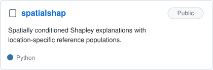</a>
  <a href="https://github.com/hujinghaoabcd/DH-STGCN">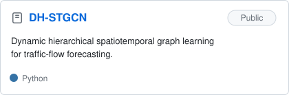</a>
   
  <a href="https://github.com/hujinghaoabcd/pyGeoHet">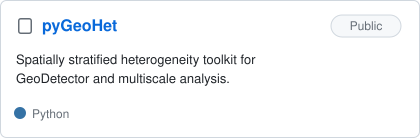</a>
  <a href="https://github.com/hujinghaoabcd/pySTARMAx">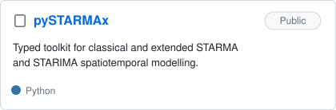</a>
   
  <a href="https://github.com/hujinghaoabcd/pyKDEX">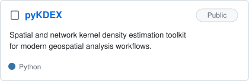</a>
  <a href="https://github.com/hujinghaoabcd/pySurveying">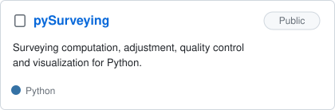</a>
   
  <a href="https://github.com/hujinghaoabcd/soil_interpolation">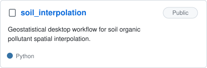</a>
  <a href="https://github.com/hujinghaoabcd/GeoPortalX">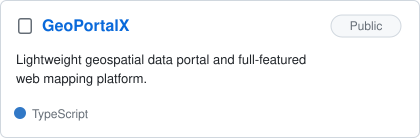</a>
   
  <a href="https://github.com/hujinghaoabcd/openlayers-webgis-platform">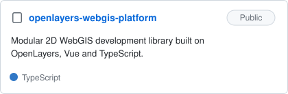</a>
  <a href="https://github.com/hujinghaoabcd/AirSimPortal">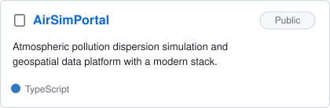</a>
   
  <a href="https://github.com/hujinghaoabcd/zhidun-crime-analysis">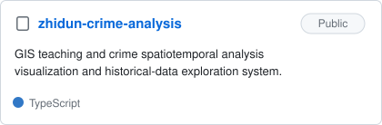</a>
  
   
  <a href="https://github.com/hujinghaoabcd/RepoForge">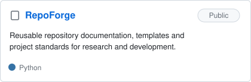</a>
  <a href="https://github.com/hujinghaoabcd/PlotLibre">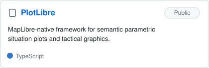</a>

---

## 🧰 Tech Stack

### Languages

### Geospatial & Scientific Computing

### WebGIS & Web Development

### Engineering

---

## 📚 Documentation & Learning

- **[WRFDoc](https://github.com/hujinghaoabcd/WRFDoc)** — documentation and learning resources for the WRF model.
- **[AERMODDoc](https://github.com/hujinghaoabcd/AERMODDoc)** — documentation and learning resources for AERMOD.
- **[python-scientific-tutorial](https://github.com/hujinghaoabcd/python-scientific-tutorial)** — scientific Python notes and reproducible examples.
- **[academic-homepage](https://github.com/hujinghaoabcd/academic-homepage)** — source repository for my academic homepage.

---

## 🔭 Current Focus

I am currently interested in developing a coherent open-source research ecosystem around:

**spatial heterogeneity · geographically weighted models · spatiotemporal forecasting · GeoAI · environmental simulation · scientific software engineering**

The goal is not only to publish models, but also to make the associated implementations, experiments, documentation, and reusable tools easier to reproduce and extend.

---

### :sparkles: [My followers](src/getTopFollowers.py)

<!--START_SECTION:top-followers-->
<table>
  <tr>
    <td align="center">
      
       
      <a href="https://github.com/eust-w">longtao</a>
    </td>
    <td align="center">
      
       
      <a href="https://github.com/trinhminhtriet">Triet Trinh</a>
    </td>
    <td align="center">
      
       
      <a href="https://github.com/Ninja1375">Antônio Nascimento </a>
    </td>
    <td align="center">
      
       
      <a href="https://github.com/chikitai">Chikita Isaac </a>
    </td>
    <td align="center">
      
       
      <a href="https://github.com/anahi-hub">anahi-hub</a>
    </td>
    <td align="center">
      
       
      <a href="https://github.com/businessservic">businessservic</a>
    </td>
    <td align="center">
      
       
      <a href="https://github.com/jingsam">jingsam</a>
    </td>
  </tr>
  <tr>
    <td align="center">
      
       
      <a href="https://github.com/mikejohnson51">MikeJohnson-NOAA</a>
    </td>
    <td align="center">
      
       
      <a href="https://github.com/Murplugg">Murplugg</a>
    </td>
    <td align="center">
      
       
      <a href="https://github.com/enfycius">Kim JongHyeok</a>
    </td>
    <td align="center">
      
       
      <a href="https://github.com/GISerDaiShaoqing">DaiShaoqing</a>
    </td>
    <td align="center">
      
       
      <a href="https://github.com/olavoparno">Olavo Parno</a>
    </td>
    <td align="center">
      
       
      <a href="https://github.com/snkd">Susant Khadka</a>
    </td>
    <td align="center">
      
       
      <a href="https://github.com/greydoubt">--</a>
    </td>
  </tr>
</table>
<!--END_SECTION:top-followers-->

---

## 📫 Contact

- **Email:** hujinghao20@mails.ucas.ac.cn
- **GitHub:** [@hujinghaoabcd](https://github.com/hujinghaoabcd)
- **Academic Homepage:** [academic-homepage](https://github.com/hujinghaoabcd/academic-homepage)

  Research with geography. Build with code. Share through open source.

